> **The American Historical Association** is the largest membership association of professional historians in the world. [The annual meeting,](https://aha.confex.com/aha/2024/meetingapp.cgi/Home/0](https://aha.confex.com/aha/2024/meetingapp.cgi/Home/0)https://aha.confex.com/aha/2024/meetingapp.cgi/Home/0) which in 2024 took place in San Francisco, was my first time at the AHA. I presented a poster about my research at the intersection of Ottoman history and computational linguistics. I created this page to share supplemantary information, including translations and links to data.
> {: .blockquote-footer }

Briefly put, the poster focused on topic modelling on 4 court histories from the 18th and 19th centuries, covering primarily the period from the 1750s through early 1800s. These histories were acquired from scholarly editions and theses, which can be found in the [bibliography](#bibliography) below. I segmented them following the internal divisions of the texts, first dividing them by year and second by the subheadings. I preprocessed these text segments to clear stopwords and normalize words, removing inflections through a customized stemming algorithm and further rule-based text cleaning. I used Gensim's LDA (Latent Dirichlet Allocation) to extract 50 topics. Text segments, both in original and in preprocessed version and the topics that are matched to those segments with their probabilities can be found [here.](../materials/preprocessed_data_wtopics_aha.csv) 

# Topic Models
In this section below you can find more details about the 10 topics directly referenced in the poster. I provided below the original word cloud, its English translation, and the probabilities associated with the words in each topic. Words and probabilities for all 50 topics can be found [here.](../materials/lda_topics_aha.csv) 

You scroll down this page to see the topics in sequential order or can use these links to navigate on the page.
1. [Topic 2](#topic-2)
2. [Topic 12](#topic-12)
3. [Topic 14](#topic-14)
4. [Topic 15](#topic-15)
5. [Topic 18](#topic-18)
6. [Topic 21](#topic-21)
7. [Topic 22](#topic-22)
8. [Topic 35](#topic-35)
9. [Topic 36](#topic-36)
10. [Topic 49](#topic-49)

## Topic 2

### Word Clouds

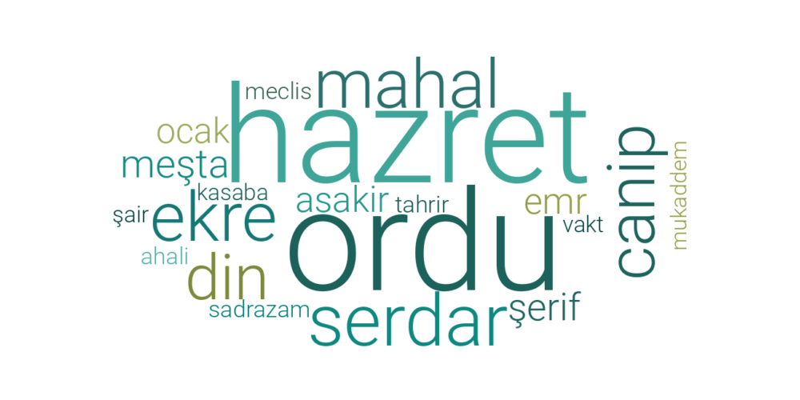 
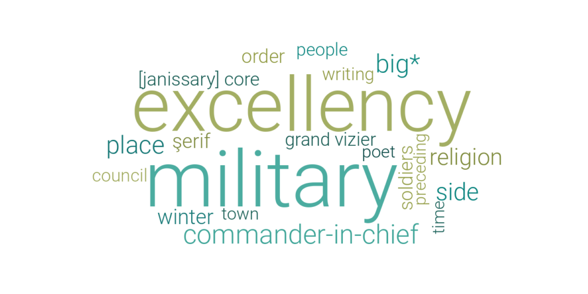

### Words, Translations, Probabilities

| Word       | English Word          | Probability   |
|------------|-----------------------|---------------|
| ordu       | military              | 0.013103897   |
| hazret     | excellency            | 0.01254922    |
| serdar     | commander-in-chief    | 0.0099619655  |
| ekre       | big*                  | 0.009035178   |
| mahal      | place                 | 0.008802253   |
| canip      | side                  | 0.008130293   |
| din        | religion              | 0.007580292   |
| meşta      | winter                | 0.0060636112  |
| şerif      | şerif                 | 0.0056301844  |
| emr        | order                 | 0.00505439    |
| asakir     | soldiers              | 0.0049434616  |
| ocak       | [janissary] core      | 0.0047960132  |
| sadrazam   | grand vizier          | 0.004566391   |
| ahali      | people                | 0.004451944   |
| tahrir     | writing               | 0.0044211755  |
| meclis     | council               | 0.0043714154  |
| vakt       | time                  | 0.0041128625  |
| kasaba     | town                  | 0.004078739   |
| şair       | poet                  | 0.0040187873  |
| mukaddem   | preceding             | 0.00386916    |

## Topic 12

### Word Clouds
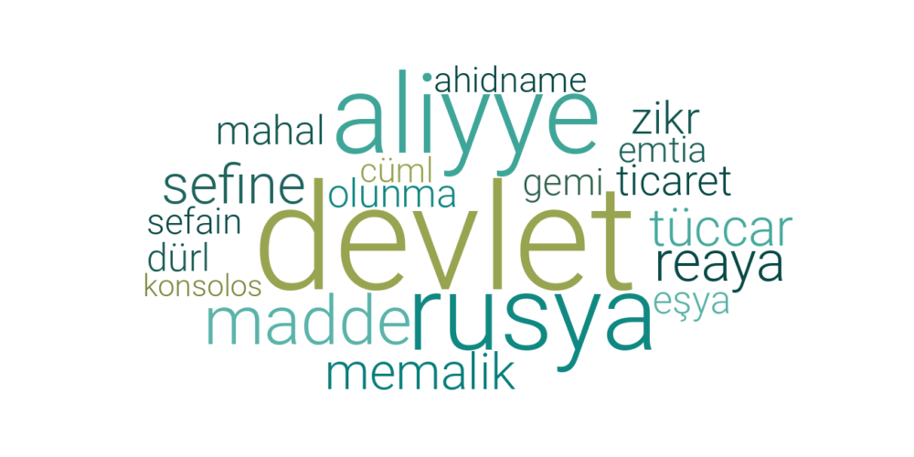 
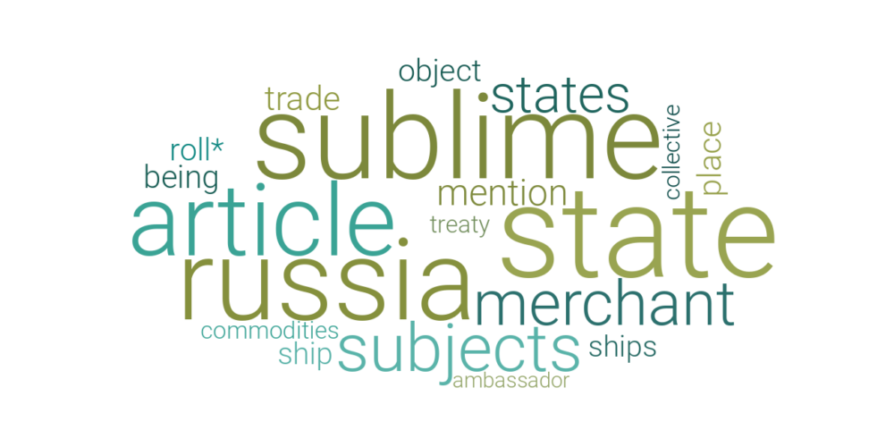

### Words, Translations, Probabilities

| Word       | English Word | Probability    |
|------------|--------------|----------------|
| devlet     | state        | 0.03876911     |
| aliyye     | sublime      | 0.03283175     |
| rusya      | russia       | 0.029672591    |
| madde      | article      | 0.025039366    |
| reaya      | subjects     | 0.015861385    |
| sefine     | ships        | 0.015506816    |
| tüccar     | merchant     | 0.013883156    |
| memalik    | states       | 0.013038843    |
| zikr       | mention      | 0.010118667    |
| ticaret    | trade        | 0.008739314    |
| mahal      | place        | 0.007867092    |
| olunma     | being        | 0.0074963016   |
| eşya       | object       | 0.0071721384   |
| dürl       | roll*        | 0.007037544    |
| gemi       | ship         | 0.0066517983   |
| sefain     | ships        | 0.006245379    |
| emtia      | commodities  | 0.0061913524   |
| ahidname   | treaty       | 0.0061222455   |
| cüml       | collective   | 0.0057454477   |
| konsolos   | ambassador   | 0.005436531    |

## Topic 14

### Word Clouds
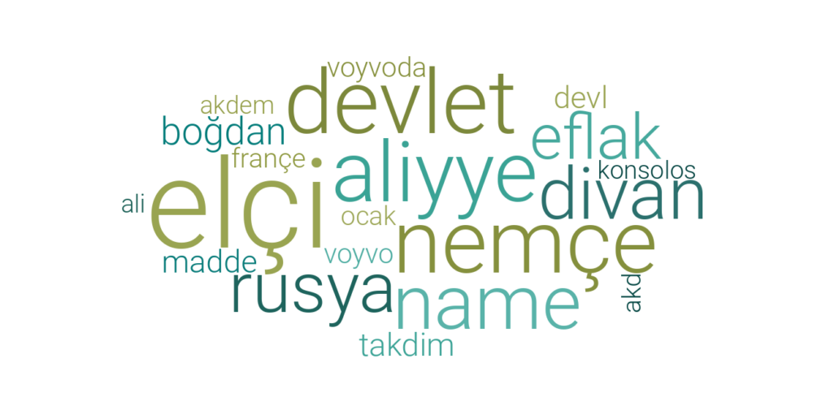
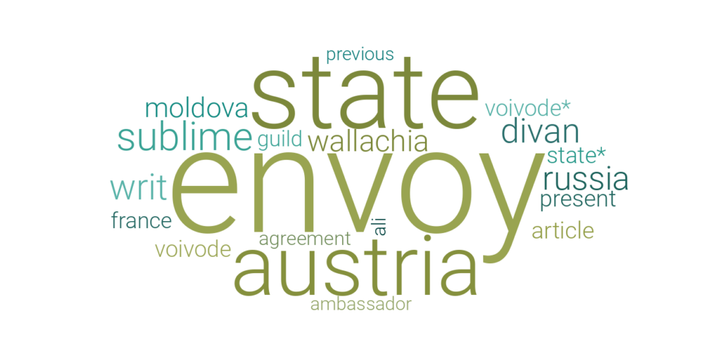

### Words, Translations, Probabilities

| Word       | English Word | Probability   |
|------------|--------------|---------------|
| elçi       | envoy        | 0.050220393   |
| devlet     | state        | 0.02200623    |
| nemçe      | austria      | 0.021864299   |
| aliyye     | sublime      | 0.01972226    |
| name       | writ         | 0.015677154   |
| divan      | divan        | 0.014308971   |
| rusya      | russia       | 0.0132787675  |
| eflak      | wallachia    | 0.010578695   |
| boğdan     | moldova      | 0.01054267    |
| takdim     | present      | 0.0070614293  |
| madde      | article      | 0.006920135   |
| devl       | state*       | 0.0067230943  |
| voyvoda    | voivode      | 0.006604344   |
| voyvo      | voivode*     | 0.00652643    |
| françe     | france       | 0.006263949   |
| ocak       | guild        | 0.0059252996  |
| akd        | agreement    | 0.0056805653  |
| ali        | ali          | 0.0054255393  |
| konsolos   | ambassador   | 0.0053069764  |
| akdem      | previous     | 0.005306057   |

## Topic 15

### Word Clouds
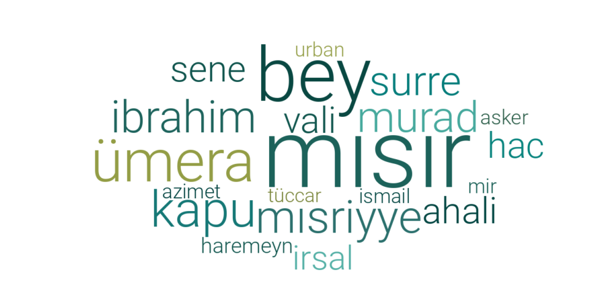
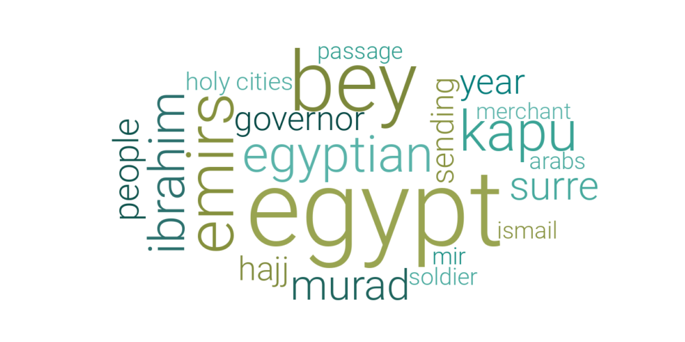

### Words, Translations, Probabilities

| Word       | English Word | Probability    |
|------------|--------------|----------------|
| mısır      | egypt        | 0.07679066     |
| bey        | bey          | 0.04401179     |
| ümera      | emirs        | 0.024421562    |
| kapu       | kapu         | 0.01741654     |
| mısriyye   | egyptian     | 0.014487155    |
| ibrahim    | ibrahim      | 0.013527957    |
| murad      | murad        | 0.012534956    |
| surre      | surre        | 0.011317682    |
| sene       | year         | 0.008648944    |
| ahali      | people       | 0.008559018    |
| vali       | governor     | 0.008500478    |
| hac        | hajj         | 0.008236179    |
| irsal      | sending      | 0.0072068265   |
| haremeyn   | holy cities  | 0.006445576    |
| asker      | soldier      | 0.005855334    |
| ismail     | ismail       | 0.0056592342   |
| mir        | mir          | 0.0055471836   |
| azimet     | passage      | 0.0054377443   |
| urban      | arabs        | 0.0053828824   |
| tüccar     | merchant     | 0.0052078157   |

## Topic 18

### Word Clouds
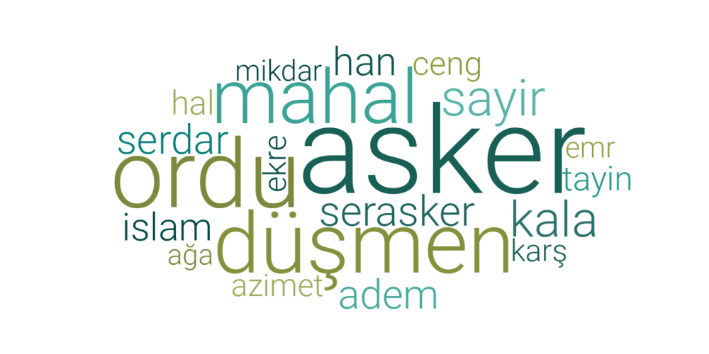
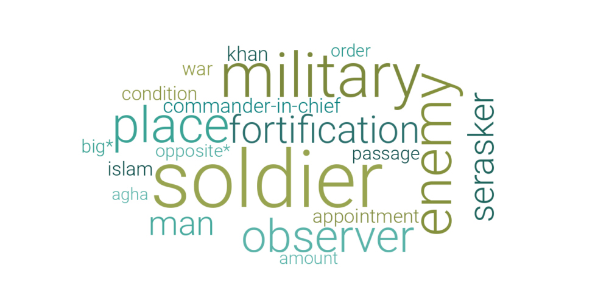

### Words, Translations, Probabilities

| Word       | English Word         | Probability    |
|------------|----------------------|----------------|
| asker      | soldier              | 0.024101831    |
| ordu       | military             | 0.013715307    |
| düşmen     | enemy                | 0.01076871     |
| mahal      | place                | 0.008583607    |
| sayir      | observer             | 0.0068993713   |
| kala       | fortification        | 0.0066033727   |
| serasker   | serasker             | 0.005685715    |
| adem       | man                  | 0.005182398    |
| serdar     | commander-in-chief   | 0.00513556     |
| han        | khan                 | 0.0048345397   |
| islam      | islam                | 0.0045238035   |
| tayin      | appointment          | 0.0044957832   |
| hal        | condition            | 0.0043301214   |
| ceng       | war                  | 0.004272922    |
| azimet     | passage              | 0.0040059546   |
| ekre       | big*                 | 0.0039833365   |
| karş       | opposite*            | 0.0038490442   |
| mikdar     | amount               | 0.0036928547   |
| emr        | order                | 0.0036706885   |
| ağa        | agha                 | 0.0035440796   |

## Topic 21

### Word Clouds
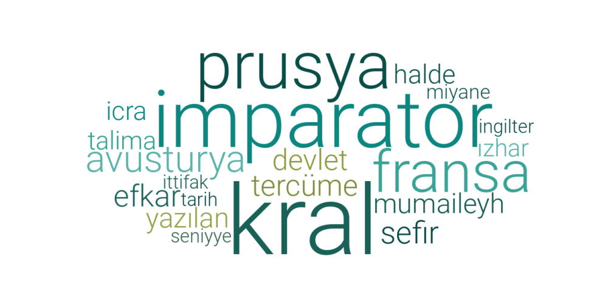
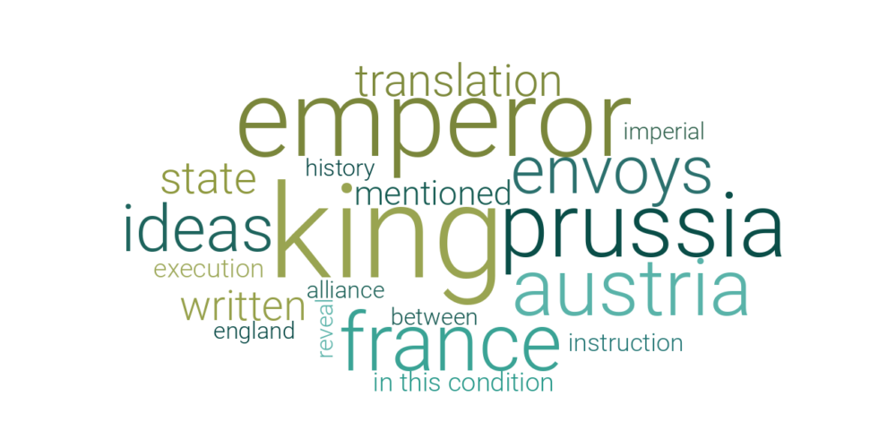

### Words, Translations, Probabilities

| Word       | English Word     | Probability   |
|------------|------------------|---------------|
| kral       | king             | 0.06196094    |
| imparator  | emperor          | 0.04018882    |
| prusya     | prussia          | 0.026708229   |
| fransa     | france           | 0.021361927   |
| avusturya  | austria          | 0.02095725    |
| sefir      | envoys           | 0.013866636   |
| efkar      | ideas            | 0.013589741   |
| tercüme    | translation      | 0.012620539   |
| devlet     | state            | 0.012364144   |
| yazılan    | written          | 0.011713989   |
| mumaileyh  | mentioned        | 0.011476178   |
| halde      | in this condition| 0.010847824   |
| icra       | execution        | 0.010592889   |
| talima     | instruction      | 0.01020762    |
| ızhar      | reveal           | 0.0093351435  |
| miyane     | between          | 0.009258929   |
| seniyye    | imperial         | 0.008988018   |
| ingiltere  | england          | 0.008906899   |
| ittifak    | alliance         | 0.008753561   |
| tarih      | history          | 0.00861064    |

## Topic 22

### Word Clouds
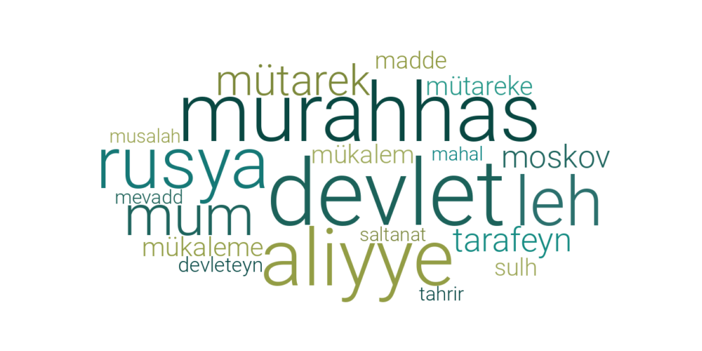
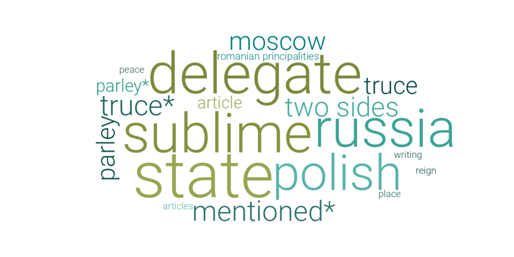

### Words, Translations, Probabilities

| Word         | English Word               | Probability    |
|--------------|----------------------------|----------------|
| devlet       | state                      | 0.029173242    |
| murahhas     | delegate                   | 0.023091683    |
| aliyye       | sublime                    | 0.021456966    |
| rusya        | russia                     | 0.020170068    |
| leh          | polish                     | 0.018115774    |
| mum          | mentioned*                 | 0.011579619    |
| mütarek      | truce*                     | 0.01154114     |
| tarafeyn     | two sides                  | 0.011015614    |
| moskov       | moscow                     | 0.009627985    |
| mükaleme     | parley                     | 0.009132737    |
| mütareke     | truce                      | 0.008596996    |
| mükalem      | parley*                    | 0.0084166415   |
| madde        | article                    | 0.0077832374   |
| sulh         | peace                      | 0.007687046    |
| devleteyn    | romanian principalities    | 0.0072544864   |
| mevadd       | articles                   | 0.0063503976   |
| tahrir       | writing                    | 0.006284845    |
| musalah      | peace                      | 0.006087658    |
| saltanat     | reign                      | 0.0059847296   |
| mahal        | place                      | 0.0059729395   |

## Topic 35

### Word Clouds
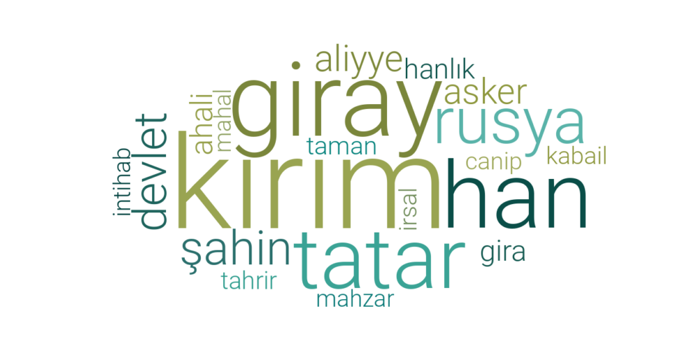
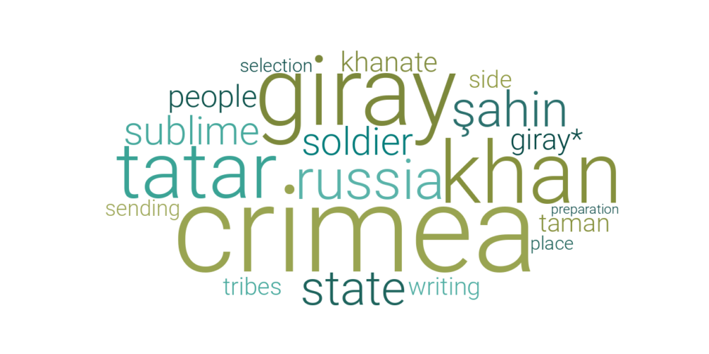

### Words, Translations, Probabilities

| Word       | English Word | Probability    |
|------------|--------------|----------------|
| kırım      | crimea       | 0.060367793    |
| giray      | giray        | 0.035838127    |
| han        | khan         | 0.028440729    |
| tatar      | tatar        | 0.023365656    |
| rusya      | russia       | 0.019349718    |
| şahin      | şahin        | 0.017983563    |
| devlet     | state        | 0.016926344    |
| aliyye     | sublime      | 0.011634736    |
| asker      | soldier      | 0.0108875185   |
| ahali      | people       | 0.007995488    |
| gira       | giray*       | 0.0072604464   |
| hanlık     | khanate      | 0.006630069    |
| taman      | taman        | 0.005328948    |
| tahrir     | writing      | 0.0051183193   |
| kabail     | tribes       | 0.0049417866   |
| canip      | side         | 0.004913694    |
| irsal      | sending      | 0.004827228    |
| intihab    | selection    | 0.004594982    |
| mahal      | place        | 0.004519427    |
| mahzar     | preparation  | 0.004426206    |

## Topic 36

### Word Clouds
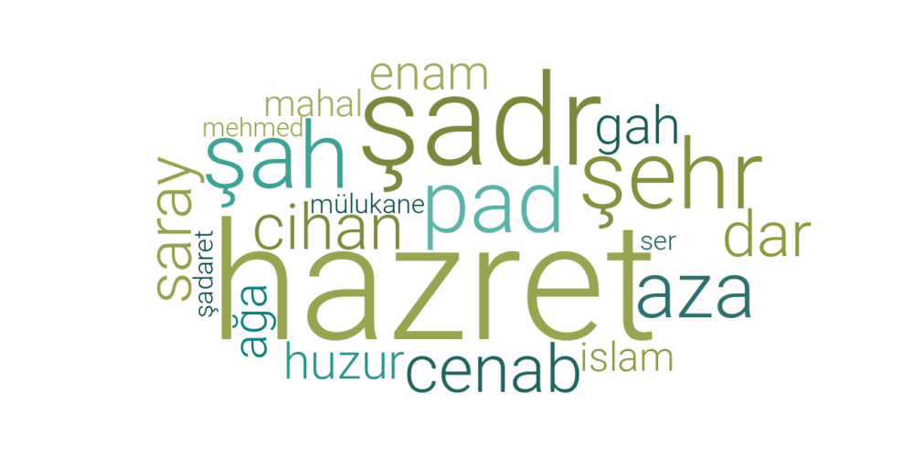
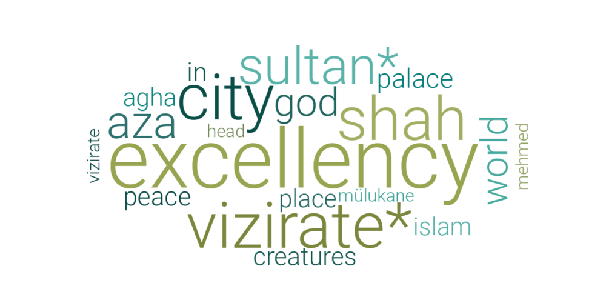

### Words, Translations, Probabilities

| Word      | English Word | Probability   |
|-----------|--------------|---------------|
| hazret    | excellency   | 0.020669926   |
| şadr      | vizirate*    | 0.011470882   |
| şehr      | city         | 0.011432505   |
| şah       | shah         | 0.0104780765  |
| pad       | sultan*      | 0.010428913   |
| aza       | aza          | 0.00807154    |
| cenab     | god          | 0.005757809   |
| cihan     | world        | 0.005262657   |
| dar       | in           | 0.0051153763  |
| saray     | palace       | 0.0050351555  |
| gah       | in           | 0.0048315967  |
| huzur     | peace        | 0.0046914984  |
| enam      | creatures    | 0.0045380592  |
| ağa       | agha         | 0.004326169   |
| islam     | islam        | 0.0043083266  |
| mahal     | place        | 0.0042961473  |
| mülukane  | mülukane     | 0.004206881   |
| ser       | head         | 0.0041008857  |
| şadaret   | vizirate     | 0.004035752   |
| mehmed    | mehmed       | 0.003921494   |

## Topic 49

### Word Clouds
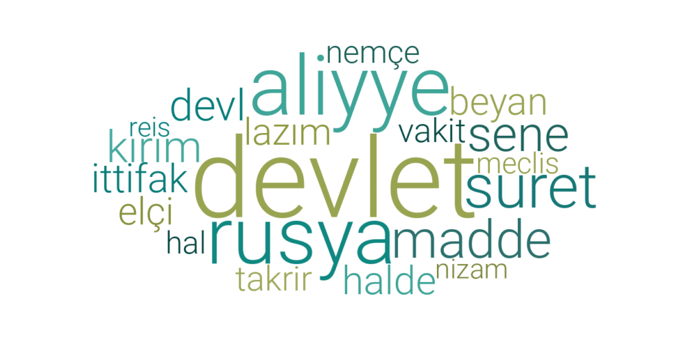
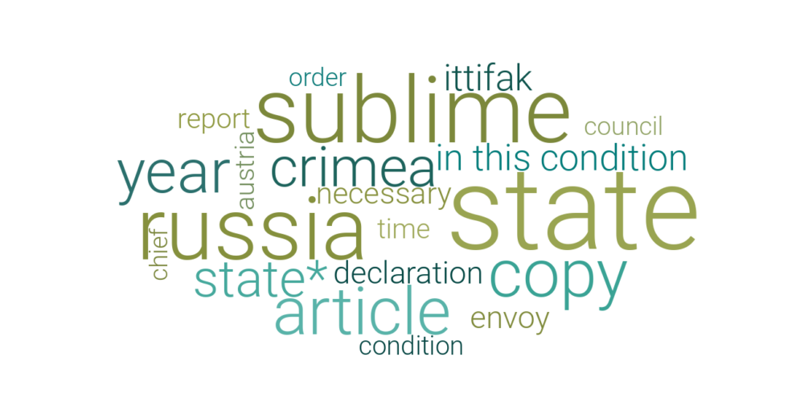

### Words, Translations, Probabilities

| Word       | English Word         | Probability   |
|------------|----------------------|---------------|
| devlet     | state                | 0.035928473   |
| aliyye     | sublime              | 0.021204332   |
| rusya      | russia               | 0.019234963   |
| suret      | copy                 | 0.010348458   |
| madde      | article              | 0.010103538   |
| sene       | year                 | 0.008661004   |
| kırım      | crimea               | 0.007026075   |
| devl       | state*               | 0.006700761   |
| alliance   | in this condition    | 0.005560158   |
| ittifak    | ittifak              | 0.005543521   |
| beyan      | declaration          | 0.0050624893  |
| elçi       | envoy                | 0.005026848   |
| lazım      | necessary            | 0.0049605784  |
| takrir     | report               | 0.004184381   |
| vakit      | time                 | 0.004053696   |
| nemçe      | austria              | 0.0038112497  |
| hal        | condition            | 0.0037401144  |
| meclis     | council              | 0.0037111714  |
| nizam      | order                | 0.003665579   |
| reis       | chief                | 0.0035061035  |

# Bibliography

