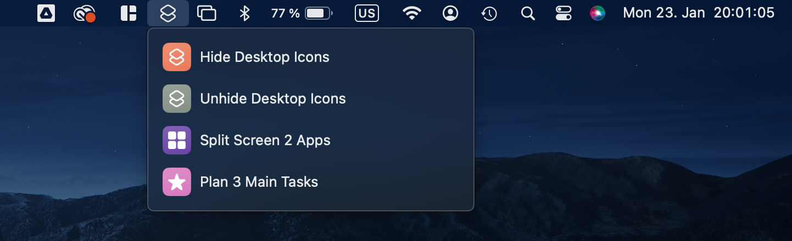

Overwhelmed by the clutter of icons on your Mac desktop, especially when you're about to share your screen? Do you just want a functionality that all Windows users have? Does it make you feel *exposed* when everyone in the meeting can see your filenames? I've crafted a simple solution to hide and unhide your desktop icons with just a click, and it's entirely free! Dive into my step-by-step guide on how to set this up without any need for additional apps. 

  <a href="https://github.com/mervetekgurler/Hide-Desktop-Icons-on-Mac/blob/main/tutorial.md" style="font-size: 20px; font-weight: bold; color: #ffffff; background-color: #24292e; text-decoration: none; padding: 10px 20px; border: 2px solid #ffffff; border-radius: 5px; display: inline-block;">
    Access the Tutorial - Click Here!
  </a>

